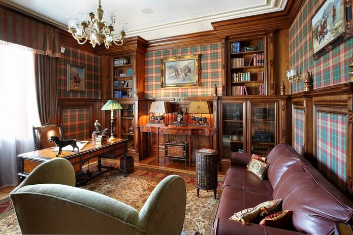
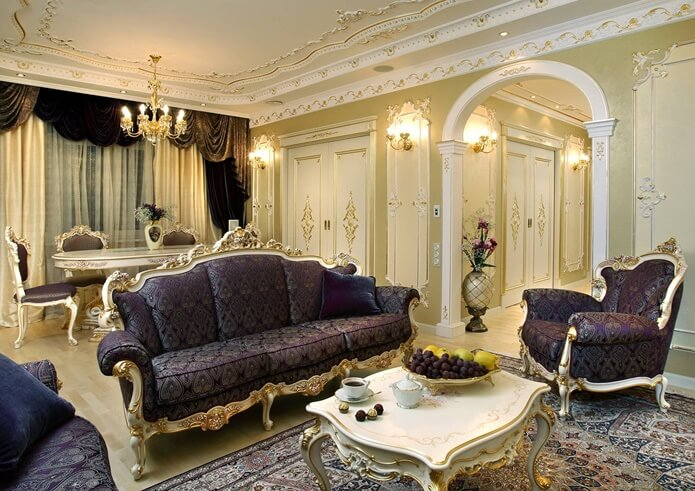
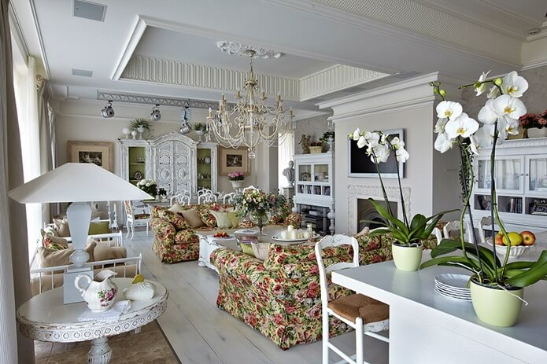
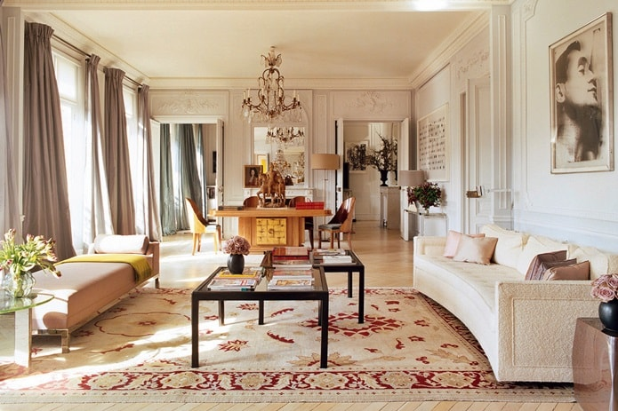
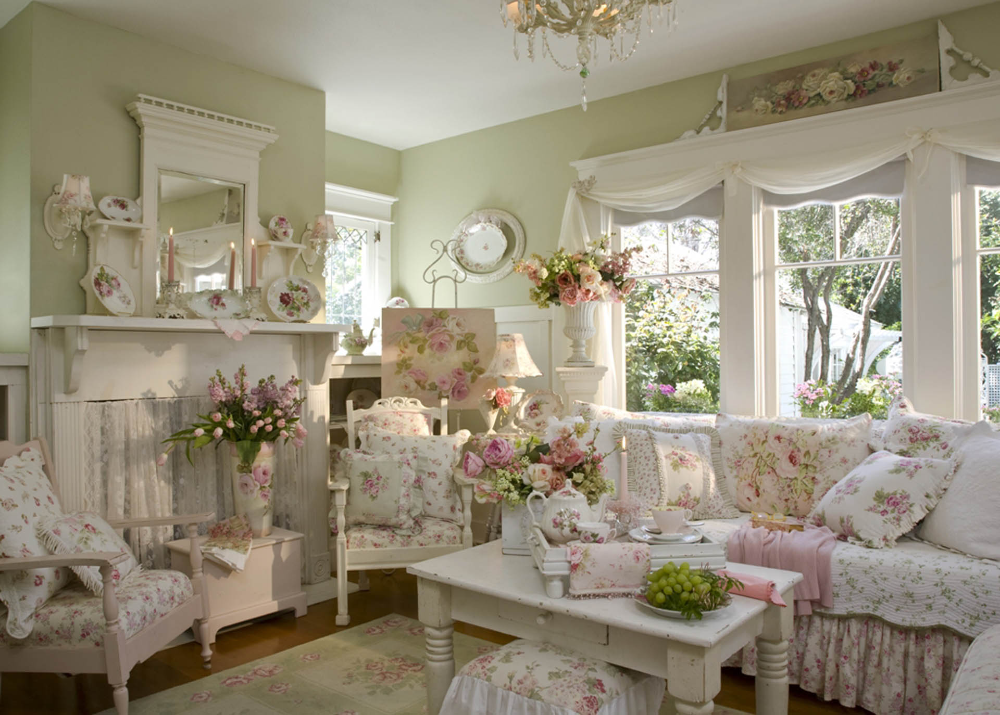

<!DOCTYPE html>
<html lang="ru">
<head>
    <meta charset="UTF-8">
    <meta name="viewport" content="width=device-width, initial-scale=1.0">
    <meta http-equiv="X-UA-Compatible" content="ie=edge">
    <title>Дизайн интерьера</title>
    </head>
<body>

<body bgcolor="#D5D7BD">

        <a class="back_to_top" title="Наверх">↑</a>

    <table width="80%" height="100%" border="0" align="center"
           bgcolor="#9B9B9B">

        <tr bgcolor="#B4A190" height="150">
            <td colspan="2">
                
<u>Стили дизайна интерьера</u>

            </td>
        </tr>

        <tr bgcolor="#F0E9DB" height="30">
            <td>
                
<i>Навигация по сайту</i>

            </td>

            <td>
                
<i>Основная информация</i>

            </td>
        </tr>

        <tr bgcolor="#FEFEFC">
            <td valign="top" width="200" bgcolor="#F4EFE6">
                 

                
<a href="#top">Авангард</a>

                
<a href="#top1">Ампир</a>

                
<a href="#top2">Английский стиль</a>

                
<a href="#top3">Античный стиль</a>

                
<a href="#top4">Арт-деко</a><

                
<a href="#top5">Барокко</a>

                
<a href="#top6">Бионика</a><

                
<a href="#top7">Бохо-шик</a><

                
<a href="#top8">Брутализм</a>

                
<a href="#top9">Версаль</a>

                
<a href="#top10">Викторианский стиль</a>

                
<a href="#top11">Винтаж</a>

                
<a href="#top12">Готический стиль</a>

                
<a href="#top13">Гранж</a>

                
<a href="#top14">Классический стиль</a>

                
<a href="#top15">Консерватизм</a><

                
<a href="#top16">Конструктивизм</a>

                
<a href="#top17">Лофт</a>

                
<a href="#top18">Минимализм</a>

                
<a href="#top19">Модерн</a>

                
<a href="#top20">Неоклассика</a>

                
<a href="#top21">Парижский стиль</a>

                
<a href="#top22">Поп-арт</a>

                
<a href="#top23">Прованс</a>

                
<a href="#top24">Рококо</a><

                
<a href="#top25">Романтизм</a>

                
<a href="#top26">Скандинавский стиль</a>

                
<a href="#top27">Стимпанк</a>

                
<a href="#top28">Футуризм</a>

                
<a href="#top29">Хай-тек</a>

                
<a href="#top30">Хюгге</a>

                
<a href="#top31">Эклектика</a>
            </td>

            <td>
                
                     
                    <b><u>Стиль интерьера</b></u> ― это совокупность характерных признаков, отличающих разные направления в отделке, оформлении, меблировке и декорировании помещений.
                      
                    Популярные стили интерьера - список с фото:

                  
                
                    
<i><b><a name="top">Авангард</a>
                 
                
                  
                
                    Авангард — современный и динамичный стиль, наполненный духом молодости и озорства. Несмотря на то, что впервые тенденции авангарда стали проявляться еще в 60-х годах прошлого века, этот стиль и сегодня выглядит весьма оригинально и часто становится основой для создания многих интерьеров или дополнением к ним.
                     
                    Яркие краски, простые текстуры, необычные формы и свежесть дизайнерских решений — все это делает интерьеры яркими и неповторимыми. Авангард — одно из направлений, которое сложно перепутать с другим, — настолько он своеобразен. Он — как противоположность традиционному пафосу исторических стилей.
                

                   
                
                    
<i><b><a name="top1">Ампир</a></b>
                 
                
                  
                
                    Более величественный, чем классика, менее вычурный, чем барокко, традиционный и немного напыщенный – таков стиль, который стал отражением римского классического дизайна с элементами древнеегипетской культуры. При этом зародился он во Франции – во времена правления Наполеона Бонапарта.
                

                   
                
                    
<i><b><a name="top2">Английский стиль</a></i></b>
                 
                
                  
                
                    Интерьер в английском стиле – это общее название различных направлений в дизайне и архитектуре, которые развивались в Великобритании от средних веков и до теперешнего времени. Приглянуться British style может элегантной сдержанностью, классической роскошью, высоким качеством материалов, наличием множества элементов декора при отсутствии кричащих акцентов. В своем завершенном виде – это образец элегантности и хорошего вкуса.
                

                   
                
                    
<i><b><a name="top3">Античный стиль</a></i></b>
                 
                
                  
                
                    Древняя Эллада и Римская империя – это культ красоты, размах и могущество.
                     
                    Стены античного дома украшают барельефами, устраивают ниши, в которых выставляют вазы или статуи. Поверхности покрывают штукатуркой либо краской насыщенных оттенков синего, зеленого и золотого в сочетании с белым; в прихожей, ванной и на кухне используют плитку «под мрамор». Идеальный потолок – в виде купола, расписной, украшенный лепниной; полы гладкие, полированные. Мебель в доме стиля антик деревянная: трапециевидные столы, стулья на характерных выгнутых ножках, скамейки, лежанки, тумбы, сундучки с мозаичными вставками.

                   
                
                    
<i><b><a name="top4">Арт-деко</a></i></b>
                 
                
                  
                
                    Богемность и претенциозность – так, в двух словах, можно описать этот стиль, распустившийся, словно цветок на руинах первой мировой войны.
                     
                    Базовые качества интерьера арт-деко – многоуровневые потолки, геометрические узоры, вкрапления из редкого сырья (слоновая кость, крокодиловая кожа, шкура зебры на полу), лакированная, глянцевая мебель, контрастная палитра, зеркала в форме лучистого солнца, дорогие ткани и обилие светильников.
                     
                    Арт-деко  сложился в эпоху индустриализации, поэтому не равнодушен к алюминию и хрому, стеклу и нержавеющей стали. Для покрытия пола используют и паркетную доску, и керамическую плитку, стены красят в яркие цвета или оклеивают обоями с выраженным геометрическим орнаментом. Потолок может быть белым с золотыми бордюрами или же темным, с подсветкой, что придаст помещению клубности. Декорируют дом винтажными постерами, работами авангардистов, ретро-статуэтками и дорогими безделушками, привезенными из путешествий.

                   
                
                    
<i><b><a name="top5">Барокко</a></i></b>
                
                 
                
                  
                
                    В переводе с итальянского слово «барокко» значит «причудливый». Войдя в фавор при самом сумасбродном короле Людовике XIV, этот стиль не спешит уходить насовсем. Барочным интерьерам присущи театральная напыщенность, изогнутость линий, игра теней, внушительность предметов, обилие зеркал и ковров.
                     
                    Стиль заточен под вельмож, поэтому среди предметов мебели главенствуют кресла, диваны и кровати. Корпулентные, помпезные, с дорогой, светлых тонов драпировкой, ножками-львиными лапами, они занимают самые почетные места.
                     
                    Текстиля много: это не только шторы и портьеры с ламбрекенами, но еще и балдахины, украшенные воланами и бантами. Расцветка тканей напоминает драгоценные металлы и камни – золото, рубин, изумруд

                   
                
                    
<i><b><a name="top6">Бионика</a></i></b>
                
                 
                
                  
                
                    Бионика весьма своеобразный стиль в архитектуре и дизайне интерьеров. Его суть заключается в тесной связи природы и новых технологических достижений. Бионический дизайн в интерьерах является наиболее прогрессивным, и одновременно естественным и близким к природе направлением.
                     
                    Его характеризуют: преимущественно светлая цветовая гамма, нестандартные приемы зонирования, структурное строение, оформление по принципу модульных конструкций.
                     
                    

                

                   
                
                    
<i><b><a name="top7">Бохо</a></i></b>
                
                 
                
                  
                
                    В последнее время он смело шагнул из уличной моды в жилища. Раскрепощенный, взбалмошный… Бохо-шик – находка для творческих личностей, для тех, кому претят однообразие и будничность. Ему свойственны красочность, эклектичность, большое количество текстиля и предметов хенд-мейд. Стены можно оклеить или покрасить, руководствуясь собственным вкусом и кошельком. Пол – дерево или плитка.
                     
                    Бохо создан для винтажной мебели, однако и современные диваны, кресла из лозы, стулья с коваными спинками прекрасно с ним поладят. Лоскутные коврики, дорожки, пледы грубой вязки, покрывала и накидки в стиле пэчворк – изюминка стиля. Подушечки-думки, валики и одеяла смотрятся, как предметы современного абстрактного искусства: их можно разглядывать, словно картины.
                     
                    

                

                   
                
                    
<i><b><a name="top8">Брутализм</a></i></b>
                
                 
                
                  
                
                    Слоган этого стиля — логичность и напористость. Характерные детали – декоративные потолочные балки, кирпичная кладка, бетонные и каменные, непокрытые поверхности и трубы. На полу допустимо ковровое покрытие, однако цвет его не должен выбиваться из цементно-каменной гаммы. Цветовая палитра — сдержанная. Предметы мебели массивные, брутальные на вид.
                     
                    

                

                   
                
                    
<i><b><a name="top9">Версаль</a></i></b>
                
                 
                
                  
                
                    Он сочетает высокопарность, свойственную королевским покоям, с достоинством, свойственным королям. Зиждется версальский стиль на тезисах барокко. А его индивидуальная черта – уникальность каждого предмета обстановки. Все, от кресла до суповой ложки, должно быть с собственной историей.
                     
                    Базовые цвета – жемчужно-серый, золотой, бирюзовый, сиреневый. Стены покрывают матовой краской, декоративной штукатуркой, полы оформляют паркетной доской или художественным ламинатом, который имитирует ценную древесину и называется «версаль». Непременные аксессуары в подобном жилище – вольтеровское кресло, софа и секретер. Придать гостиной вид салона можно, если выбрать мебель с закругленными краями и задрапировать стены полупрозрачными тканями.
                     
                    

                

                   
                
                    
<i><b><a name="top10">Викторианский стиль</a></i></b>
                
                 
                
                  
                
                    Викторианский стиль – синтез пропорций классики, элементов готики, барокко и восточной, колониальной экзотики. Скажем, библиотеку украшают на готический лад, гостиную оформляют в индийском или китайском вкусе, а в спальне царствует рококо.
                     
                    Стены можно оклеить обоями с тиснением, абрисами цветов и птиц, или тканевыми шпалерами с росписью из дубовых, папоротниковых листьев. Неплохая мысль – панели из матового дерева. Для пола предпочтительней паркет или же плитка с «деревянной» текстурой.
                    Цветовое решение – оттенки бурого, вишневый с фрагментами зеленого, лавандового, миндального оттенков.
                     
                    

                

                   
                
                    
<i><b><a name="top11">Винтаж</a></i></b>
                
                 
                
                  
                
                    Этим словечком – vintage – французы называют раритетные вина, выпущенные в самые удачные, урожайные годы. А в дизайне интерьеров, винтаж – обстановка прошлого, как правило, конца ХIX — начала XX века.
                     
                    Винтаж не предъявляет жестких требований к материалам отделки. Да, он не приемлет ультрановых технологий, однако и не просит дорогой древесины и натурального камня. Поскольку стиль декоративный, изобилующий подробностями, стены лучше оклеить светлыми, нейтральными обоями или выкрасить. А пол не грех застелить ковролином.
                     
                    

                

                   
                
                    
<i><b><a name="top11">Георгианский стиль</a></i></b>
                
                 
                
                  
                
                    Особенности георгианского интерьера – традиционный камин, наличие красного дерева, лепнины, украшения из цветного стекла. Стены в таком доме, как и предписано классическими нормами, делили на три части: цокольную обшивали деревянными панелями, середину покрывали тканью или обоями, а верхнюю украшали фризом и карнизами. Паркетные полы до блеска натирали воском или покрывали лаком. Для пущего уюта использовали ковры, доставленные из колоний. Мебель в таком жилище состоит в едином гарнитуре, все предметы основательны, практичны, но не лишены очарования. Из тканей отдавали преимущество бархату, дамасту, гобеленам.
                     
                    Обязательными элементами считались картины, посуда из тончайшего китайского фарфора, привезенные из Поднебесной веера, серебряные табакерки.
                     
                    

                

                   
                
                    
<i><b><a name="top12">Готический стиль</a></i></b>
                
                 
                
                  
                
                    Устрашающе-величественный, загадочный, религиозный – такова, если кратко, характеристика готического стиля. Готика в жилье – это камень, древесина дуба, сосны или кедра, мозаичные полы, винтовая лестница, витражные окна, бронзовая или кованая фурнитура, высокие буфеты, столы с большим количеством выдвижных и потайных ящиков, сундуки, обтянутые кожей. Цвета – густо-коричневый, карминный, концентрированный синий или желтый.
                     
                    Спинки стульев, изголовья кроватей тоже высокие, напоминающие контурами башни. Сундуки при надобности служат столами или скамейками. Вся мебель – из мрачноватой, темной древесины. В спальне к месту шкуры и меховые накидки. Декорируют помещение статуэтками из дерева, серебра и камня, бронзовыми шандалами, рыцарскими кубками и латами.
                     
                    

                

                   
                
                    
<i><b><a name="top13">Гранж</a></i></b>
                
                 
                
                  
                
                    Этот стиль — побег из городского муравейника на деревенские просторы, из пафосных апартаментов в удобные «гнезда». Начало ему положили французские богачи: устав от светской жизни, они все чаще селились в глуши, в домах уютных, но с лаконичной обстановкой. Союз достатка и простоты популярен и сегодня.
                     
                    Ткани выбирают натуральные, незатейливые. Зато мебель – элегантная, плавных форм и уважаемых брендов. Шкафам и сервантам предпочитают стеллажи, монументальным столам – раздвижные и тумбы. Декоративные акценты расставляют при помощи выбеленного дерева, искусственных потертостей, патины на рамках для зеркал, кованых деталей и примитивных фигурок животных. А пара лоскутных подушек, пестрый плед, брошенный в кресло, и ретро-плакат на стене станут яркими, заключительными мазками.
                     
                    

                

                   
                
                    
<i><b><a name="top14">Классический стиль</a></i></b>
                
                 
                
                  
                
                    В сущности, это целое почтенное семейство старых и даже старинных, проверенных временем стилей. К подобным, вечным образцам относятся античные, все исторические, а также национальные стилистики. Общие свойства – натуральные стройматериалы, правильная геометрия, симметричность, композиционность, связанность между собой всех предметов мебели и декора, несколько источников света, национальный отпечаток.
                     
                    Классика сегодня – колонны, пилястры, лепнина, арочные конструкции, камин с порталом, лиричные, пастельные тона, достаточно много текстиля, картины на стенах, напольные часы, статуэтки и недешевые вазы.
                     
                    

                

                   
                
                    
<i><b><a name="top15">Консерватизм</a></i></b>
                
                 
                
                  
                
                    Если вы домосед и настороженно относитесь ко всяческим сюрпризам, то, скорее всего, вы консерватор и стиль этот создан для вас. В доме, где господствуют консервативные порядки, все знакомо, всюду привычные, нужные вещи. Консерватизм – враг сумбура, все предметы на «насиженных» местах и передаются по наследству.
                     
                    Мебель может быть отделана шпоном под мореное дерево. Окна убирают простыми, без рисунка шторами, стены покрывают обоями теплого цвета: сливочного, орехового, грушевого. В подобный дом напрашивается камин, на полках которого можно расставить черно-белые фото патриархов семьи, подчеркнув тем самым связь поколений. Не обойтись и без настенных светильников, поскольку этот интерьер нуждается в мягком, притушенном свете.
                     
                    

                

                   
                
                    
<i><b><a name="top16">Конструктивизм</a></i></b>
                
                 
                
                  
                
                    Проявления констуктивизма – это геометризм помещения, высокая функциональность предметов мебели и даже предметов декора, передвижные перегородки, естественное освещение, скудная расцветка.
                     
                    Стены покрывают безликой штукатуркой, штукатурят также потолок либо укрепляют на нем панели с подсветкой.
                    Полы застилали паркетом, сегодня допустимы линолеум и ламинат. Материалы – шпон, металл, стекло, прочный пластик. Стол сделан для того, чтобы за ним обедать, стул, чтобы сидеть, кровать, чтобы спать – таково отношение конструктивизма к мебели. То есть, никаких изгибов и загогулин – все по делу. А украшения, спросите вы? Черно-белого эстампа на стене и стеклянной вазы на подоконнике будет достаточно. Мало? Зато конструктивизм доступен всем и подходит для жилища любой величины.
                     
                    

                

                   
                
                    
<i><b><a name="top17">Лофт</a></i></b>
                
                 
                
                  
                
                    Лофт – тренд в дизайне интерьера, при помощи которого под дорогое, элитарное жилье адаптируют заброшенные промышленные сооружения: цеха, ангары, гаражи. При этом лофт соединяет старое (бетонные стены, лестницы, балки, вентиляцию и трубы) и актуальное (мягкая, мебель, зеркала, новейшая техника) в стильный, единый ансамбль.
                     
                    Интерьеру лофт присущи полное отсутствие внутренних перегородок, высокий, характерный для индустриального сооружения потолок, зонирование при помощи контрастной окраски, трубы, шахты, кабеля и прочее фабрично-заводское «приданое» в качестве декора. Материалы – бетон, кирпичная кладка, грубая штукатурка, керамические плиты на полу. Мебель служит не только по прямому назначению, но делит комнату на рабочую зону и зону для отдыха.
                     
                    

                

                   
                
                    
<i><b><a name="top18">Минимализм</a></i></b>
                
                 
                
                  
                
                    Точность композиции, простота и лапидарность обстановки, отсутствие декора для декора – суть минималистического стиля. Его узнаешь безошибочно по малому количеству мебели, пространству, разделенному на зоны, многоуровневому освещению, нейтральной цветовой палитре, блеску стекла и металла, по обилию природного света, которое льется сквозь большие окна.
                     
                    Отделочные материалы – простые, без затей: нетронутый кирпич, необработанное дерево, бетон или простая штукатурка. Мебель корпусная, с плоскими поверхностями. Формы предметов примитивно-геометрические. В потолок прячут подсветку из неоновых или галогенных ламп. Шторы считаются лишними, их заменяют роллетами.
                     
                    

                

                   
                
                    
<i><b><a name="top19">Модерн</a></i></b>
                
                 
                
                  
                
                    Реквизиты стиля: много дерева твердых и ценных пород, пластичность и фигурность линий, изогнутее, как лебединые шеи лестницы, закругленные проемы, барельефы, узоры в виде лилий, ирисов, стрекоз, витражи, художественная ковка. Потолки декорируют и деревом, и гипсовой лепниной, кессонами и молдингами. Стены обшивают панелями из недешевой древесины, драпируют светлым шелком. Лучший вариант для пола – живописный паркет.
                     
                    Мебель компактная, деревянная, плавной, причудливой формы, с изощренной резьбой и инкрустациями. Цвета модерна – жемчужный, небесно-голубой, пепельно-розовый, приглушенно-лавандовый. Текстиль – портьеры и шторы из богатой материи с рисунком из маков, орхидей или павлиньих перьев. Свет источают люстры с матовыми плафонами, бра в виде канделябров. Старинные часы, полотна и несколько ваз из антикварной лавки завершат труды по созданию интерьера.
                     
                    

                

                   
                
                    
<i><b><a name="top20">Неоклассика</a></i></b>
                
                 
                
                  
                
                    Мебель компактная, деревянная, плавной, причудливой формы, с изощренной резьбой и инкрустациями. Цвета модерна – жемчужный, небесно-голубой, пепельно-розовый, приглушенно-лавандовый. Текстиль – портьеры и шторы из богатой материи с рисунком из маков, орхидей или павлиньих перьев. Свет источают люстры с матовыми плафонами, бра в виде канделябров. Старинные часы, полотна и несколько ваз из антикварной лавки завершат труды по созданию интерьера.
                     
                    Стены окрашивают либо оклеивают обоями кремового, голубого, фисташкового тона, полы покрывают светлой доской, потолкам придают белый цвет, оформляя неброской лепниной. Дверные проемы, бывает, украшают пилястрами. Элегантная, из светлой или красной древесины мебель располагается симметрично относительно центра; в гостиной, как правило, находится камин.
                     
                    

                

                   
                
                    
<i><b><a name="top21">Парижсикй интерьер</a></i></b>
                
                 
                
                  
                
                    Парижский интерьер отражает в себе — шик и богемную утонченность столицы. Современные парижские квартиры – это чистые, наполненные светом пространства, функциональные и уютные одновременно. Говоря о материалах для мебели, можно надолго углубиться в то разнообразие, которым пестрят парижские квартиры. Это и классические деревянные предметы с резными элементами, и пластик, и стекло, и металл, в том числе, хромированный или патинированный.
                     
                    Особой любовью у парижан пользуются натуральный текстиль: бархат, лен, шерсть и шелк, часто кружево, причем, даже в мужских интерьерах оно встречается, правда, в более сдержанном виде. Кислотные оттенки розового, желтого и зеленого следует оставить для фьюжн или китча, а интерьер в парижском стиле – это средоточие умеренных цветовых сочетаний, чистых или производных пастельных, разбавленных графичным серым либо черным.
                     
                    

                

                   
                
                    
<i><b><a name="top22">Поп-арт</a></i></b>
                
                 
                
                  
                
                    Поп-арту присущи глянцевая текстура, контрастные цветовые сочетания, присутствие кислотных «вспышек», концертные афиши, портреты и автографы кумиров на видных местах (даже на подушках, занавесках и декоративных тарелках), неоновое, светодиодное, с эффектом софитов освещение, а еще применение обычных бутылок и консервных банок в качестве ваз.
                     
                    Мебель поп-арта – кресла-кровати, встроенные шкафы, различные удобные трансформеры. Диваны предпочтительно кожаные, пуфы и кресла синтетические, столики низкие, овальные или округлые. Тяжелые гардеробы, серванты, буфеты отправлены на свалку. Для пущего эффекта добавляют салатовые, лазерно-лимонные, ядовито-фиолетовые коврики на пол. Поп-арт – резкий и вызывающий вид обстановки, поэтому, решившись на него, лучше всего ограничиться только гостиной.
                     
                    

                

                   
                
                    
<i><b><a name="top23">Прованс</a></i></b>
                
                 
                
                  
                
                    Секрет прованса – в удивительной гармонии, соединившей деревенскую простоту и галантное изящество, шарм романтизма и хозяйственную смекалку, пышность замысла и скромность отделки
                     
                    Стены штукатурят и окрашивают в молочный, карамельный, медовый, кукурузный оттенки. Окрашивают нарочито небрежно, имитируя трещинки, щербины, патину. Для отделки используют и дикий камень, и глазурованный кирпич. Потолки в провинциально-французском особняке высокие и с балками, на которые подвешивают утварь, полотняные мешочки с пряными травами и сухоцветы. Полы каменные или дощатые, исчерченные временем. Занавески на окнах легкие, пропускающие ласковый бриз и солнечные лучи. Для их пошива используют ситец, батист и сатин, однотонный или же с нежным цветочным узором. Скатерти и салфетки чаще из хлопка, с вышивкой и мережками. Мебель состаренная, с семейной историей. Об этом свидетельствуют фамильные вензеля, резные ножки, кованные ажурные вставки. Придутся ко двору и плетеные кресла, и крашеные комоды, и, конечно, открытый буфет, уставленный фаянсовыми мисками и кувшинами. Повсюду старые предметы быта: тяжелые утюги, наборы для рукоделия, фаянсовые рукомойники. На полках и комодах фото бабушек и дедушек, патриархов семьи, бутылки и шкатулочки, расписанные в технике декупаж, кованые подсвечники, птичьи клетки, на стенах застекленные, в рамочках цветы и бабочки, а на полу горшки с лавандой. Интерьер в прованском стиле – берег мечты для всех уставших от суеты мегаполиса.
                     
                    

                

                   
                
                    
<i><b><a name="top24">Рококо</a></i></b>
                
                 
                
                  
                
                    Рококо – интерьер эксклюзивный, штучный. Для его создания требуется много средств и не меньше условий. Первое из них – достаточно большие габариты домовладения. Ведь закругление стен, резные панели, позолоченные бордюры, огромные зеркала требуют места. Центральным предметом в гостиной рококо был и остался камин, оправленный в мрамор. Его украшали часы, канделябры из бронзы, фарфоровые безделушки, а сверху зеркало в неистово-роскошной раме. Обязательна и люстра с лампами-свечами, подвесками в виде морских раковин, бронзовыми или золочеными цепями. Между зеркалами желательно укрепить светильники-бра.
                     
                    Мебель-рококо изогнутых линий, покрытая лаком, украшенная бронзовыми накладками и ювелирной резьбой. Характерные предметы обстановки – секретеры с потайными ящиками, канапе, комоды, картоньерки, туалетные столики на изогнутых, «паучьих» ножках. Обворожительные эти атрибуты должны быть приятны на ощупь и удобны в пользовании. Спектр рококо – акварельные расцветки, сияющие оттенки драгоценных камней, блеск золота.
                     
                    

                

                   
                
                    
<i><b><a name="top25">Романтизм</a></i></b>
                
                 
                
                  
                
                    Для стиля характерны цветочные мотивы, негрубые, мягкие материалы, пастельные тона, распиная фурнитура, ажурная резьба и кружева, рассеянное освещение. Резких линий и углов нужно избегать, однако необузданная вычурность стилю тоже не свойственна. Материалы подойдут натуральные: светлое дерево, гладкая керамика, стекло. На потолке используют лепнину, полы покрывают паркетом, стены оклеивают обоями в мелкий цветочный орнамент, украшают зеркалами, акварелями.
                     
                    Мебель – закругленных силуэтов, с бархатистой обивкой, резными деталями, весенне-светлого, даже белого цвета. Горячо одобряются музыкальные инструменты, к примеру, рояль: ведь что может быть романтичнее музыки? На первых ролях в романтическом жилище – гладкие, воздушные, ласковые ткани. Их много: это и подушечки, и широкие покрывала, и невесомые балдахины, и накидки на стулья, и струящиеся занавеси. Украшая квартиру романтика, добавляют щепотку гламура: перламутровые плафоны, серебряную шкатулку, безделицу из слоновой кости.
                     
                    

                

                   
                
                    
<i><b><a name="top26">Скандинавский стиль</a></i></b>
                
                 
                
                  
                
                    Его особенности – избыток дневного света, благодаря панорамным окнам, натуральные, экологические материалы, удобная мебель из светлого дерева, оптимистичные тона. Стены штукатурят либо покрывают краской льняного, сливочного, незабудкового цвета. Достойная альтернатива – отделка деревянными панелями, которая, к тому же, поделит пространство на зоны. Полы тоже светлые, паркет или ламинат, с сосновым, ольховым, липовым узорами.
                     
                    Мебель негромоздкая, функциональная, с обивкой из кожи, замши, хлопка и льна. Плотным портьерам и шторам места не найдется, их заменяют роллетами, полупрозрачными занавесками. Концепцию сближения с природой поддерживают аксессуары: глиняные, соломенные поделки, корзинки из лозы, лоскутные одеяла и коврики, сухоцветы. Типичная деталь – пейзажи маринистов и фотографии с морской тематикой на стенах. Скандинавский стиль утверждает фамильные ценности, поэтому желательно развесить и расставить также семейные фото…
                     
                    

                

                   
                
                    
<i><b><a name="top27">Стимпанк</a></i></b>
                
                 
                
                  
                
                    Стимпанк – это мир шестеренок, гаек, анкеров, рычагов и поршней. Его миссия – напомнить о времени, когда был создан первый двигатель, а почетное место алхимиков заняли механики с их доселе невиданными изобретениями. Материалы, присущие стилю, – металл, стекло, в отделке стен древесина и камень. Стены можно покрыть гладкими, «металлическими» красками или оклеить, а потолок оборудовать под пристань для «летальных аппаратов», подвесив всевозможные модели цеппелинов.
                     
                    Цвета интерьера хмурые: грифельный, древесно-коричневый, темно-вишневый. Мебель либо темного, либо насыщенного цвета: кресла с кожаными сиденьями и каркасом из трубок, диваны с медными заклепками, низкие столы и шкафчики с выдвижными, на шарнирах ящиками, оснащенные особой, из болтов и шурупов фурнитурой. Поскольку квартира в стиле стимпанк – нечто среднее между лабораторией и кабинетом чудака-механика, в ней обязаны быть стеллажи, заполненные книгами.
                     
                    

                

                   
                
                    
<i><b><a name="top28">Футуризм</a></i></b>
                
                 
                
                  
                
                    Креативный, необычный, современный — это про футуризм! Главными свойствами этой стилистики являются: эргономика, функциональность, новейшие материалы и технологии, а также максимум свободного пространства. Стены, потолки и мебель могут иметь необычные формы и конфигурацию. Монохромность светлого интерьера разбавляют яркими акцентами, привнося разнообразие в цветовую палитру. Декором служат новинки бытовой, аудио и видео-техники…
                     
                    

                

                   
                
                    
<i><b><a name="top29">Хай-тек</a></i></b>
                
                 
                
                  
                
                    Случайным вещам в доме хай-тек не место. Если голый бетон не вдохновляет, допустимо покрасить стену или оклеить обоями цвета металлик. Потолок часто украшают декоративные балки. Полы – дерево, ламинат или же плитка с системой обогрева, разумеется. Мебель из современной синтетики, стекла и нержавейки, легкая и без декора. В фаворе столы-книжки, стеклянные шкафы, из которых, не тратя лишней секунды, можно достать необходимую вещь, встроенные купе, низкие диваны-трансформеры.
                     
                    Текстиль лишен декоративного «звучания». Окна прикрывают жалюзи, роллеты или рулонные шторы. Однако, чтобы смягчить спартанство обстановки, можно повесить и занавески – из плотной, без оборок ткани с металлическим отливом. Из украшений позволительны абстрактное панно, цифровые рамки, большой аквариум с рыбками. Находка для хай-тека – фигурки техно-арт: подставка для ручек в виде миниатюрного байка, сувенирные автомобили, хромированные скелеты динозавров и металлические парусники. Но главные предметы декора и гордости в доме хай-тек – это новейшая техника: мониторы, экраны, дисплеи, системные блоки и пульты, придающие стилю характерный, неподражаемый глянец.
                     
                    

                

                   
                
                    
<i><b><a name="top30">Хюгге</a></i></b>
                
                 
                
                  
                
                    Хюгге – это все что связано с комфортом, дарящим ощущение счастья. Представьте: за окном мороз, а вы сидите в мягком кресле, укутавшись пушистым пледом, потягиваете чай из любимой чашки и задумчиво щуритесь на пламя камина… Это уютное ощущение и есть хюгге! Основные признаки стиля: натуральные материалы; светлые, приятные тона; теплые, деревянные полы; обилие осветительных приборов, свечи; мелочи, дорогие сердцу; подушки, пледы, ковры, природный декор; винтаж.
                     
                    

                

                   
                
                    
<i><b><a name="top31">Эклектика</a></i></b>
                
                 
                
                  
                
                    Предметы прошлого, настоящего и отчасти будущего пытается составить в одну композицию эклектический стиль. А равновесие при этом достигается, благодаря определенным хитростям. Главная из них заключается в том, что все разностильные вещи должны подходить друг другу по цвету, сочетаться либо схожестью фактуры, либо формы. Шторы, пледы и подушки объединяются по этому же принципу.
                     
                    Потолок и стены окрашивают или оклеивают материалами индифферентного цвета для дальнейшего создания ярких, контрастных пятен, панно или фрагментов с росписью. Нередко используют кафельные изразцы, густо испещренные орнаментом. Для пола приемлем любой вариант, а также ковры и дорожки из разных стилевых эпох. Мебель тоже «разновозрастная»: резной буфет, оставшийся в наследство, и велюровый модный диван, отреставрированный комод и барный пластиковый табурет. Главное, напомним, чтоб эти предметы удачно совпадали по оттенкам.
                     
                    

                
                   

            </td>
        </tr>
        <tr bgcolor="#EAEAE8" height="40">
            <td colspan="2"></td>
        </tr>
    </table>

    

</bod>
</html>
